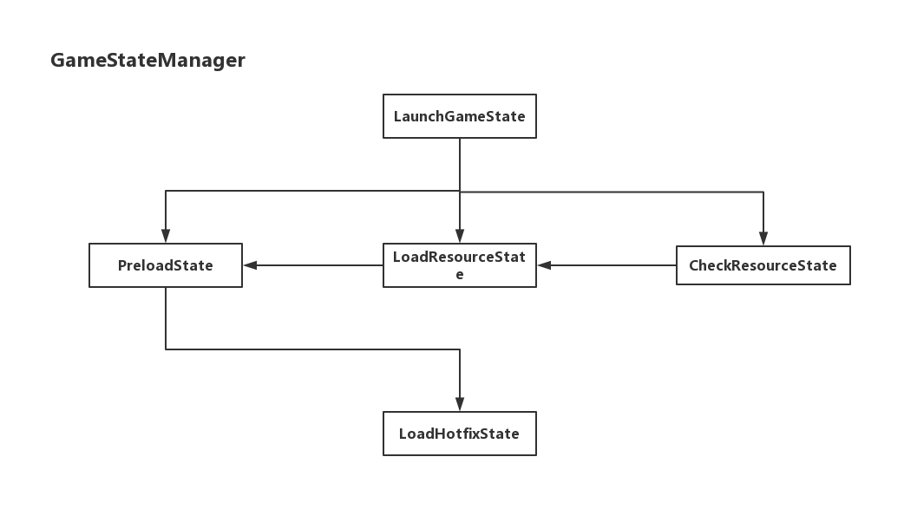

# GameFamework

## 环境配置

### 机器环境:
- Unity 2018.3.11f1 (64-bit)
- Window10 专业版
- Visual Studio 2017

### 开发环境：
1. clone GameFamework
``` bat
$ git clone git@github.com:SixGodZhang/GameFamework.git
```

2. Unity 打开项目 && VS 打开项目工程  
示例场景: Assets -> Game -> Scenes -> SampleScene

3. 主要目录介绍:
- AssetBundles: 暂存各个平台打包之后的ab资源文件
- Assets: 主要工程及其资源目录
  - ATFramewoek: 抽象出来的一些公共API,比如Unity Editor下的一些UI库、批处理工具、Log模块、Md5模块等
  - Example: 一些示例的资源
  - Game: 与游戏强相关(what? 就是每个游戏都有一些独立的内容,就放在这个目录)的目录
  - GameFramework: 游戏框架核心代码位置
  - Plugin: 需要支持不同平台插件所在位置
  - StreamingAsets: 游戏中使用的资源所在位置
  - ThirdParty: 第三方插件所在位置,无视平台
- HotFix: 热更工程(项目的主要逻辑所在位置)
- pdb2mdb: 调试文件转换工具所在文件夹
- UnityEngineLibary: Unity各个所在模块引用所在位置

4. 项目配置:
- vs打开项目工程
- 右键解决方案 -> 添加 -> 现有项目 -> 将Hotfix.csproj引入到解决方案中
- 检查项目依赖和引用:
 - HotFix.csproj 依赖于 Assembly-Csharp.csproj(在项目的解决方案的属性中可以查询到)
 - HotFix.csproj 引用了Unity的相关dll,如果出现丢失,可以重新UnityEngineLibary文件夹下的所有dll
 - 检查HotFix后期生成事件命令行,如下
 ``` bat
copy $(TargetDir)Hotfix.dll $(SolutionDir)pdb2mdb /y
copy $(TargetDir)Hotfix.pdb $(SolutionDir)pdb2mdb /y

pushd $(SolutionDir)pdb2mdb
pdb2mdb.exe Hotfix.dll

copy Hotfix.dll $(SolutionDir)Assets\Game\Hotfix\Hotfixdll.bytes /y
copy Hotfix.dll.mdb $(SolutionDir)Assets\Game\Hotfix\Hotfix.dll.mdb.bytes /y
 ```
 
5. 运行游戏即可
	如果出现资源下载失败等情况,请切换资源加载方式:
	如下:
	Resource Update Type: Editor
	UseHotfix：取消勾选
	
### 游戏模块介绍
#### 游戏状态机(GameState Module)
这里的游戏状态是指游戏处于哪一种状态行为下.目前我在游戏中建立了如下几种状态:
- LaunchGameState: 游戏启动状态<行为: 1.确定以何种方式下载资源(local,update)>
- PreloadState: 预加载状态<目前的一个过渡状态,会直接切换到LoadHotfixState状态中>
- LoadResourceState: 加载资源状态<是直接加载资源? 还是加载ab文件?>
- CheckResourceState: 对比资源差异
- LoadHotfixState: 加载热更代码


在Unity Editor下可以观察到State在哪一个阶段: 


#### 游戏生命周期管理(Game Life Manager)
游戏的生命周期是依赖于Monobehaviour的生命周期. 因为ilruntime的加入,我们不能简单地在热更工程中直接使用Monobehavior,
所以需要重新定义一个游戏生命周期的方案.
游戏分不同的模块,每个模块都应该有自己的生命周期,为了统一,使用一个GameModuleProxy来代理所有模块的生命周期,然后再把
GameModuleProxy放入MonoBehavior的生命周期中即可.


